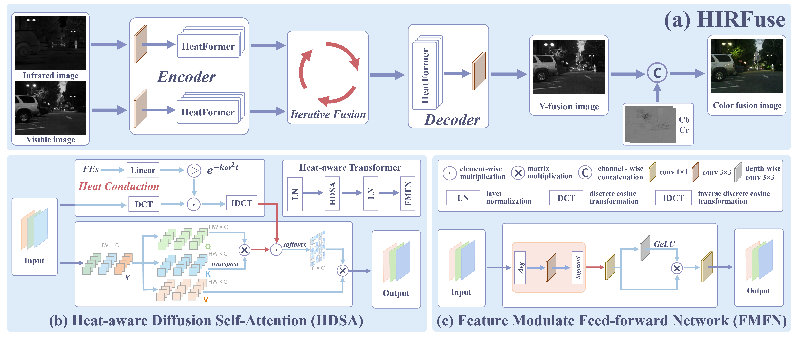

# HIRFuse

Codes for ***Heat-aware and Iterative Refinement Image Fusion***.

[Dingli Hua](), [Qingmao Chen](https://hinmouc.github.io), [Zhiliang Wu](), [Yifan Zuo](), [Yuming Fang]().


## Abstract

Transformer-based fusion methods have gained great attention due to their long-range semantic interaction capabilities. Nevertheless, traditional self-attention mechanisms struggle to effectively identify variations in feature frequencies and lack physical interpretability. Furthermore, mainstream `one-step fusion' schemes are simplistic and convenient, but fail to adequately reconcile complex spatial structures and semantic differences, thereby limiting the stability and performance of fusion results. To address these challenges, this paper introduces a physical modeling and optimization theory-inspired heat-aware iterative refinement fusion framework, named HIRFuse. Firstly, to address the lack of physical guidance and frequency selectivity in traditional self-attention, we design a novel HeatFormer unit. By incorporating a two-dimensional heat conduction mechanism to dynamically regulate different frequency responses, our HeatFormer effectively highlights valuable semantic structures and suppresses irrelevant signals. Simultaneously, it utilizes dynamic channel recalibration and a local spatial gating mechanism to achieve feature modulation and refinement. Secondly, to achieve substantial improvements from conventional shallow fusion to multi-step progressive fusion, we propose an iterative refinement fusion module in terms of the stability of the heat diffusion operator. This module progressively optimizes fusion features through diffusion-convergence processes, thereby enabling steady-state fusion of multimodal information. Experiments on multiple public benchmarks and downstream applications validate the superiority and effectiveness of the proposed approach.


## Pipeline




## Demo

### 🚀 Train

Modify the variable 'dataset' on  ``train.py``, and run

```
python train.py
```

### 🧪 Test

**1. Pretrained models**

Pretrained models are available in [checkpoint]().

**2. Test cases**

The 'test_cases' folder contains seven examples that appear in the main paper. Running 

```
python test.py
```

will fuse these cases, and the fusion results will be saved in the ``./test_result`` folder.


## 📝Citation

If this work is helpful to you, please cite it as:

```
@ARTICLE{2026HIRFuse,
  title={Heat-aware and Iterative Refinement Image Fusion},
  author={Hua, Dingli and Chen, Qingmao and Wu, Zhiliang and Zuo, Yifan and Fang, Yuming},
  journal={IEEE Transactions on Multimedia},
  year={2026},
}
```
